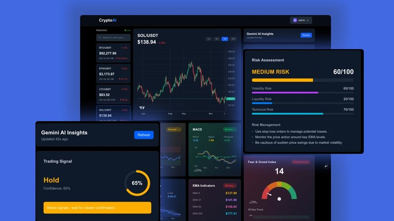
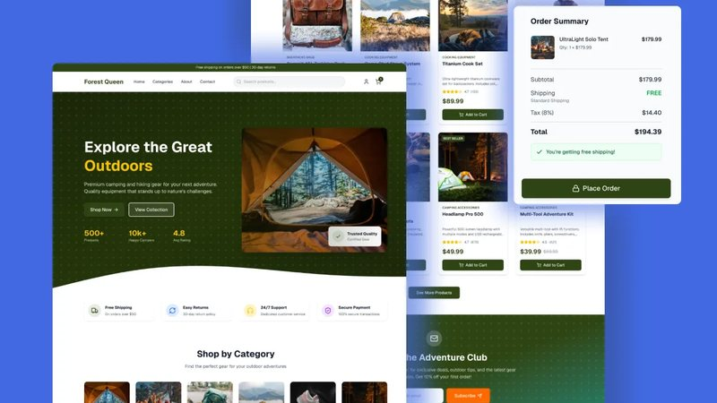
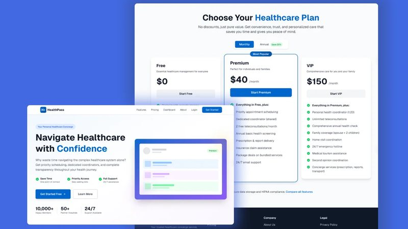
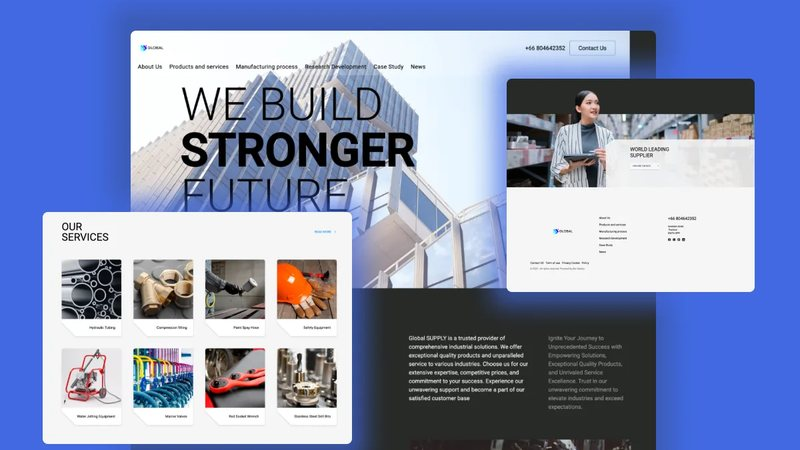
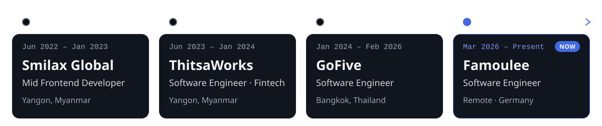
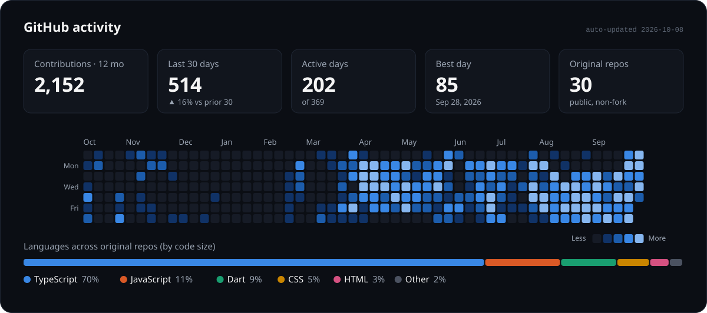

<a href="https://htet-aung-linn-portfolio.vercel.app/">
  <picture>
    <source media="(prefers-color-scheme: dark)" srcset="assets/header-dark.svg">
    <source media="(prefers-color-scheme: light)" srcset="assets/header-light.svg">
    
  </picture>
</a>

  
  
  
  

### About me

I build web products from front to back: Next.js and React on the front end, Node.js APIs in the middle, and MongoDB or PostgreSQL underneath. I've been shipping for 4+ years across fintech, SaaS and consumer products. Right now I'm a **Software Engineer at Famoulee**, a Germany-based multilingual platform for family relationships and memory preservation, working remotely from Bangkok.

- **Day to day:** Next.js · Node.js · TypeScript · MongoDB
- **Also comfortable with:** Angular, NestJS, GraphQL, PostgreSQL, Flutter
- **On the side:** market-data dashboards and web3 experiments ([Crypto AI](https://github.com/htetaunglinn-dev/crypto-ai), [CoinVault](https://github.com/htetaunglinn-dev/coinvault))
- **Ask me about:** Next.js performance, API design, MongoDB data modelling, and deploying Node on Linux

### Tech stack

<table>
  <tr>
    <td width="120"><b>Frontend</b></td>
    <td>
      <picture>
        <source media="(prefers-color-scheme: light)" srcset="https://skillicons.dev/icons?i=ts,js,react,nextjs,angular,redux,tailwind,sass&theme=light">
        
      </picture>
    </td>
  </tr>
  <tr>
    <td><b>Backend</b></td>
    <td>
      <picture>
        <source media="(prefers-color-scheme: light)" srcset="https://skillicons.dev/icons?i=nodejs,express,nestjs,graphql&theme=light">
        
      </picture>
    </td>
  </tr>
  <tr>
    <td><b>Data</b></td>
    <td>
      <picture>
        <source media="(prefers-color-scheme: light)" srcset="https://skillicons.dev/icons?i=mongodb,postgres,redis,firebase&theme=light">
        
      </picture>
    </td>
  </tr>
  <tr>
    <td><b>Mobile</b></td>
    <td>
      <picture>
        <source media="(prefers-color-scheme: light)" srcset="https://skillicons.dev/icons?i=flutter,dart&theme=light">
        
      </picture>
    </td>
  </tr>
  <tr>
    <td><b>Cloud &amp; tools</b></td>
    <td>
      <picture>
        <source media="(prefers-color-scheme: light)" srcset="https://skillicons.dev/icons?i=docker,aws,vercel,githubactions,git,linux&theme=light">
        
      </picture>
    </td>
  </tr>
</table>

### Featured projects

<table>
  <tr>
    <td width="50%" valign="top">
      
      <h4>Crypto AI Analysis</h4>
      Real-time crypto analytics with AI-driven market insights and trend analysis.
        
      <code>Next.js</code> <code>TypeScript</code> <code>Python</code> <code>TensorFlow</code>
        
      <a href="https://crypto-ai-analysis.vercel.app/"><b>Live demo ↗</b></a> &nbsp;·&nbsp; <a href="https://github.com/htetaunglinn-dev/crypto-ai">Code</a>
    </td>
    <td width="50%" valign="top">
      
      <h4>Forest Queen</h4>
      E-commerce store for outdoor and camping gear, with catalogue, cart and Stripe checkout.
        
      <code>React</code> <code>Node.js</code> <code>TypeScript</code> <code>Stripe</code>
        
      <a href="https://forest-queen-ecommerce.vercel.app/"><b>Live demo ↗</b></a> &nbsp;·&nbsp; <a href="https://github.com/htetaunglinn-dev/forest-queen-ecommerce">Code</a>
    </td>
  </tr>
  <tr>
    <td width="50%" valign="top">
      
      <h4>HealthPass</h4>
      Personal healthcare concierge: priority scheduling and care coordination with real-time updates.
        
      <code>React</code> <code>TypeScript</code> <code>Socket.io</code> <code>Redis</code>
        
      <a href="https://healthpass-bkk.vercel.app/"><b>Live demo ↗</b></a> &nbsp;·&nbsp; <a href="https://github.com/htetaunglinn-dev/healthpass">Code</a>
    </td>
    <td width="50%" valign="top">
      
      <h4>Global Supply</h4>
      Logistics dashboard for tracking shipments and managing the supply chain end to end.
        
      <code>Next.js</code> <code>TypeScript</code> <code>WebSocket</code> <code>MongoDB</code>
        
      <a href="https://global-supply.vercel.app/"><b>Live demo ↗</b></a> &nbsp;·&nbsp; <a href="https://github.com/htetaunglinn-dev/Global-Supply">Code</a>
    </td>
  </tr>
</table>

<b>More builds</b>

 

| Project | What it is | Stack |
| --- | --- | --- |
| [Money Tracker](https://github.com/htetaunglinn-dev/money-tracker) · [live](https://money-tracker-chi-one.vercel.app) | Personal finance tracker for the web | Next.js, TypeScript |
| [Money Tracker (Flutter)](https://github.com/htetaunglinn-dev/money-tracker-flutter) | The same tracker as a native mobile app | Flutter, Dart |
| [CoinVault](https://github.com/htetaunglinn-dev/coinvault) | Crypto wallet and vault experiment with smart contracts | TypeScript, Solidity |
| [Portfolio](https://github.com/htetaunglinn-dev/htet-aung-linn-portfolio) · [live](https://htet-aung-linn-portfolio.vercel.app) | My personal site | Next.js, TypeScript, Tailwind CSS |

### Experience

<picture>
  <source media="(prefers-color-scheme: dark)" srcset="assets/experience-dark.svg">
  <source media="(prefers-color-scheme: light)" srcset="assets/experience-light.svg">
  
</picture>

### Activity

<picture>
  <source media="(prefers-color-scheme: dark)" srcset="assets/activity-dark.svg">
  <source media="(prefers-color-scheme: light)" srcset="assets/activity-light.svg">
  
</picture>

  Always happy to talk shop. The fastest way to reach me is <a href="mailto:htaunglin@gmail.com">email</a> or <a href="https://www.linkedin.com/in/htet-aung-linn-51146923b">LinkedIn</a>. I'm on GMT+7.

